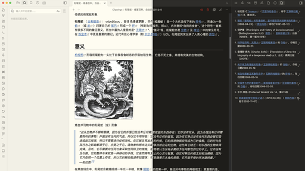

# Ouroboros

[中文说明](./README_CN.md) | English

Ouroboros is a clean, warm, and focused theme for [Obsidian](https://obsidian.md). It is inspired by the calm structure of Things, the ink-friendly warmth of Flexoki, and the needs of long-running knowledge work: reading, writing, research, planning, and plugin-heavy vault maintenance.

The goal is not to turn Obsidian into a loud dashboard. Ouroboros keeps accent color as a guide for state, focus, and hierarchy while leaving the content surface quiet enough for sustained work.

## Highlights

- Warm light and dark palettes tuned for paper-like reading and low visual fatigue
- Refined typography, spacing, tables, callouts, code blocks, tags, metadata, prompts, sidebars, and search results
- Style Settings controls for accent presets, UI density, heading style, link decoration, CJK typography, code/highlight polish, reduced motion, and reading modes
- Recoverable Focus mode and Keyboard mode for dimmed chrome, visible rails, stronger focus rings, and command/switcher hints
- Semantic workflow callouts for decisions, risks, principles, insights, and iteration cycles
- Modern Obsidian coverage for Bases, Properties, Command Palette, Quick Switcher, File Explorer navigation rails, Bookmarks, Search, Outline, and Canvas
- Modern Canvas styling for nodes, groups, edges, labels, controls, color picker, and minimap
- Research reading mode for source-heavy notes with citations, footnotes, annotations, highlights, and evidence tables
- Publish / Print / PDF export support for links, footnotes, tables, code blocks, callouts, and figures
- Longform reading mode for essays, chapters, scene breaks, editorial quotes, and sustained prose rhythm
- Mobile-aware adjustments for smaller screens and touch-heavy workflows

## Screenshots

Screenshot assets are kept in sync for release surfaces:

- `screenshot.png` — 512×288 community-theme / README preview image.
- `_resources/img/image-comparison-v1.png` — high-resolution source image used to regenerate `screenshot.png`.
- `preview/CHECKLIST.md` — release-quality visual QA checklist to run before replacing screenshots or expanding README claims.

## Installation

### From Obsidian Community Themes

1. Open **Settings** in Obsidian.
2. Go to **Appearance** -> **Themes**.
3. Click **Manage** and search for `Ouroboros`.
4. Click **Install and use**.

### Manual Installation

1. Download the latest release from [GitHub Releases](https://github.com/Lemon695/obsidian-theme-ouroboros/releases).
2. Extract `theme.css` and `manifest.json`.
3. Copy them into `.obsidian/themes/Ouroboros/` inside your vault.
4. Open **Settings** -> **Appearance** -> **Themes** and select `Ouroboros`.

## Customization

Ouroboros exposes a broad set of options through the Style Settings plugin and CSS variables.

Notable options include:

- Style packs: Classic Paper, Things Warm, Research Desk, Longform Book, Night Ink, and Low Contrast Calm
- Accent presets: moss, amber, sage, ink-blue, clay, and slate
- Paper temperature: warm or cool paper surfaces (light and dark)
- Density presets: compact UI and airy reading
- Reading width: a column-width tier (Narrow / Standard / Relaxed / Wide) plus an advanced custom width, bound to Obsidian's readable line length
- Reading font: an optional serif / Western body-font profile (System sans / Iowan-Palatino serif / Georgia modern serif / Inter humanist) for the body and editor surface only — the interface chrome stays sans, and CJK mode / style packs still override it
- Numbered headings: optional CSS-counter outline numbers (1, 1.1, 1.1.1) for H1–H4 in both Reading View and Live Preview
- Code blocks: curated language labels (Reading View), clearer copy-button hover/active, and stronger but calm diff contrast
- Nested tags: a quiet hierarchy cue for `#parent/child` tags and clearer nesting guides in the Tags sidebar
- Graph view: warm-paper background, a brighter focused/current node with an accent ring, and quieter links
- Highlight pens: eight low-saturation `<mark class="red|orange|yellow|green|cyan|blue|purple|pink">` colors for Reading View
- Active path emphasis: a warm low-noise cue for the active tab, active pane title, and current breadcrumb segment — only the current item is emphasized
- Daily / periodic dashboard: a `dashboard` cssclass that turns Dataview/Tasks blocks into calm paper widget panels (composes with `cards`)
- Task priority palette: an opt-in mode that maps Tasks-plugin priorities (highest…lowest) to the warm progress 5-color ramp as a quiet left rail, with a warm due chip — urgency reads warm-to-cool
- Paper panes: an opt-in mode that turns editor tab groups into raised paper sheets (thin border, soft shadow, rounded corners) with a quiet accent lift on the active pane; sidebars stay flat
- Typewriter focus: a Focus-mode sub-toggle that dims inactive lines and emphasizes the active line while editing, with centered composition room (Live Preview only)
- Bullet threading: a default-on Logseq-style outline cue — a rounded accent thread connects every ancestor bullet down to the active list line (editor only, 6 indent levels)
- Clean embeds: an opt-in mode (Style Settings toggle or per-note `embed-clean` cssclass) that strips the card chrome from transclusions so embedded notes read as part of the host note
- Content helper classes: `cards`, `cards-cover`, `cards-compact`, `table-wide`, `table-small`, and `table-clean`
- Low-noise navigation rails and current-path highlights for File Explorer / Bookmarks / Outline
- Image / figure / gallery helpers: `img-grid`, `img-wide`, `img-frame`, and `figure-note`
- Publish / Print / PDF export polish for links, footnotes, tables, code, callouts, and figures
- Link underline controls for internal and external links
- Fancy code blocks and fancy highlight styles
- Recoverable Focus mode, Keyboard mode, and reduced-motion mode
- Research reading mode for source-heavy notes
- Longform reading mode for essays and chapter drafts
- CJK typography and serif toggle
- Adjustable heading sizes, weights, and colors
- Tag, highlight, inline code, and progress color controls

## Plugin and core view support

Compatibility claims are tiered and conservative. See [`docs-code-ai/PLUGIN-COMPATIBILITY-AUDIT.md`](./docs-code-ai/PLUGIN-COMPATIBILITY-AUDIT.md) for exact plugin ids, preview coverage, and fragile selector notes.

Preview-covered core/plugin surfaces:

- Bases (core)
- Properties / File properties / All properties (core)
- Command Palette / Quick Switcher (core)
- Bookmarks / Search / Outline / File Explorer (core)
- Canvas (core)
- Dataview
- Calendar / Full Calendar
- Tasks
- Kanban
- Obsidian Git

Selector-level integrations:

- Todoist Sync
- Excalidraw
- Hover Editor
- Banners
- Checklist
- Outliner
- Timeline

Legacy selector-only:

- DB Folder (`.db-table-view`; official plugin id was not present in the Obsidian community plugin directory during the M5-4 audit)

If a plugin is not listed, it should still inherit Obsidian core tokens where possible, but it is not part of the dedicated visual QA surface yet.

## Known limitations

Known limitations and unsupported plugin claims are tracked in [`docs-code-ai/KNOWN-LIMITATIONS.md`](./docs-code-ai/KNOWN-LIMITATIONS.md). Short version:

- Selector-level integrations should be verified in your own vault before relying on exact plugin layout parity.
- DB Folder is legacy selector-only and is not listed in theme metadata until an official plugin id and live DOM are confirmed.
- Mobile FAB styling and version-sensitive surfaces such as Bases, Canvas, Properties, prompt/suggestions, and Full Calendar require manual QA for release candidates.
- Plugins absent from the compatibility audit inherit core tokens where possible, but are not dedicated support claims.

## Compatibility

- Minimum Obsidian version: `1.0.0`
- Current theme version: `1.0.2`
- Works in both light and dark mode
- CSS-only theme; no JavaScript plugin dependency

## Development

The repository includes the modular source used to build the published theme.

1. Clone the repository.
2. Edit the source files in [`src/`](./src/).
3. Run `npm run build` to regenerate `theme.css`.
4. Run `npm run check` to validate version metadata, Style Settings syntax, and build output.
5. Optional: sync preview fixtures to a disposable vault with `npm run sync:vault -- /path/to/vault --preview`.
6. Review changes in Obsidian using [`preview/CHECKLIST.md`](./preview/CHECKLIST.md) before updating screenshots or release notes.
7. Review [`docs-code-ai/KNOWN-LIMITATIONS.md`](./docs-code-ai/KNOWN-LIMITATIONS.md) before expanding plugin claims.
8. For release preparation, use [`docs-code-ai/RELEASE-CHECKLIST.md`](./docs-code-ai/RELEASE-CHECKLIST.md).

### Source structure

- `src/00-header.css`: theme banner and root variables
- `src/01-foundation.css`: core palette, style packs, typography, layout, app chrome, Properties, prompt/suggestion, tree/search, reading modes, and Focus mode
- `src/02-code.css`: code blocks and syntax highlighting
- `src/03-mobile.css`: mobile-specific adjustments
- `src/04-tasks-and-progress.css`: custom task states and progress styling
- `src/05-plugins-primary.css`: primary plugin and workbench integrations, including Dataview helpers, Bases, and Canvas
- `src/06-plugins-secondary.css`: secondary plugin integrations
- `src/07-style-settings.css`: Style Settings definitions
- `src/08-plugin-compat.css`: plugin compatibility metadata
- `src/09-animations.css`: motion and animation controls

## Preview QA

The preview suite is intentionally local-first and vault-friendly:

- `preview/core-showcase.md` — typography, links, tags, callouts, tables, code, properties/frontmatter, prompt/sidebar notes
- `preview/tasks-showcase.md` — checkbox states and progress bars
- `preview/plugin-showcase.md` — Bases, Dataview, Calendar, Kanban, Canvas, Git, and plugin-facing surfaces
- `preview/canvas-workflow.canvas` — Canvas nodes, groups, edges, labels, controls, color picker, and minimap
- `preview/research-reading-showcase.md` — Research reading mode
- `preview/longform-reading-showcase.md` — Longform reading mode
- `preview/presets-showcase.md` — M6 style pack palette, rhythm, and accent override checks
- `preview/reading-width-showcase.md` — M9 reading width tier, advanced custom width, and `--file-line-width` binding checks
- `preview/reading-font-showcase.md` — M10 reading font profile checks (serif/Western `variable-select`, body+editor only, UI chrome stays sans, CJK/pack precedence)
- `preview/numbered-headings-showcase.md` — M9 numbered headings (H1–H4) in Reading View and Live Preview, per-note reset, callout exclusion
- `preview/code-block-showcase.md` — M9 code-block language labels, copy-button hover/active, and diff contrast checks
- `preview/nested-tags-showcase.md` — M9 nested-tag cue and tag-pane nesting guide checks
- `preview/graph-view-showcase.md` — M9 graph warm-paper, focused node, current-note ring, and quiet-link checks
- `preview/highlight-pens-showcase.md` — M10 multi-color highlight pen checks (8 colors, light/dark)
- `preview/accent-paper-showcase.md` — M10 expanded accent palette and paper-temperature checks
- `preview/active-path-showcase.md` — M10 current-path / active-note emphasis checks (active tab, pane title, breadcrumb)
- `preview/dashboard-showcase.md` — M10 daily/periodic dashboard layout checks (`dashboard` cssclass, widget panels, cards composition)
- `preview/task-priority-showcase.md` — M10 task priority palette checks (opt-in, `data-task-priority` mapped to progress 5-color ramp, warm due chip)
- `preview/paper-panes-showcase.md` — M10 paper panes checks (opt-in, editor tab groups as raised sheets, active-pane accent lift, sidebars stay flat)
- `preview/typewriter-focus-showcase.md` — M10 typewriter focus checks (Focus-mode sub-toggle, dim inactive lines, active-line emphasis, centered room, Live Preview only)
- `preview/bullet-threading-showcase.md` — M12 bullet threading checks (default-on, rounded accent thread to the active list line, editor only)
- `preview/clean-embeds-showcase.md` — M12 clean embeds checks (opt-in toggle / `embed-clean` cssclass, chrome-free transclusions, hover rail)
- `preview/content-helpers-showcase.md` — M6 cards, table, and Dataview helper classes
- `preview/navigation-showcase.md` — M6 folder rail, current-path, and tree navigation checks
- `preview/image-figure-gallery-showcase.md` — M6 image grid, wide image, frame, and figure caption checks
- `preview/focus-mode-showcase.md` — Focus mode 2.0, Keyboard mode, hover/focus recovery, and command/switcher hints
- `preview/publish-print-showcase.md` — M6 Publish / Print / PDF export checks
- `preview/CHECKLIST.md` — manual release-quality gate for light/dark, Style Settings variants, mobile/accessibility, plugin workbench checks, screenshots, and sign-off evidence

## Contributing

Issues and pull requests are welcome. If you spot a bug, visual regression, or plugin compatibility issue, please include screenshots, Obsidian version, OS/device, enabled Style Settings options, and reproduction details.

## Credits

Ouroboros draws inspiration from:

- [Things Theme](https://github.com/colineckert/obsidian-things) by @colineckert
- [Things App](https://culturedcode.com/things/) by Cultured Code
- [Flexoki](https://github.com/kepano/flexoki) by @kepano for the warm, ink-friendly color system

## License

Released under the [MIT License](LICENSE).
