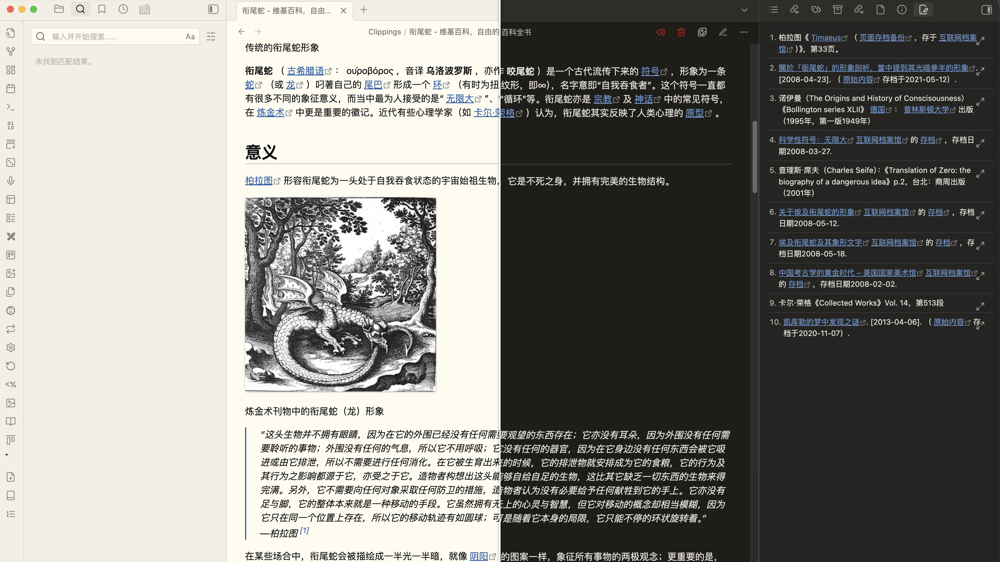

# Ouroboros

[中文说明](./README_CN.md) | English

Ouroboros is a clean and elegant theme for [Obsidian](https://obsidian.md), inspired by the calm structure and visual restraint of Things. It is designed to feel warm, readable, and focused in both light and dark mode while still offering enough flexibility for people who want to fine-tune the interface.

## Highlights

- Carefully balanced light and dark palettes with a warm, paper-like visual tone
- Refined typography, spacing, tables, callouts, code blocks, tags, and metadata styling
- Style Settings support for accent presets, density tweaks, heading controls, and link decoration
- Optional focused modes such as fancy code blocks, active-line highlighting, focus mode, and reduced motion
- CJK typography options for Chinese, Japanese, and Korean note-taking
- Custom task states, progress styling, and polish for common writing and knowledge workflows
- Mobile-aware adjustments for a smoother experience on smaller screens

## Screenshots

## Installation

### From Obsidian Community Themes

1. Open **Settings** in Obsidian.
2. Go to **Appearance** -> **Themes**.
3. Click **Manage** and search for `Ouroboros`.
4. Click **Install and use**.

### Manual Installation

1. Download the latest release from [GitHub Releases](https://github.com/Lemon695/obsidian-theme-ouroboros/releases).
2. Extract `theme.css` and `manifest.json`.
3. Copy them into `.obsidian/themes/ouroboros/` inside your vault.
4. Open **Settings** -> **Appearance** -> **Themes** and select `Ouroboros`.

## Customization

Ouroboros exposes a broad set of options through the Style Settings plugin and CSS variables.

Notable options include:

- Accent presets: moss, amber, and sage
- Density presets: compact UI and airy reading
- Link underline controls for internal and external links
- Fancy code blocks and fancy highlight styles
- Focus mode and reduced-motion mode
- CJK typography and serif toggle
- Adjustable heading sizes, weights, and colors
- Tag, highlight, inline code, and progress color controls

## Plugin Support

Ouroboros includes dedicated styling for several commonly used community plugins, including:

- Dataview
- Calendar
- Tasks
- Todoist
- Excalidraw
- Full Calendar
- Hover Editor
- Banners
- Canvas
- Checklist
- Kanban
- Outliner
- DB Folder
- Timeline
- Obsidian Git

## Compatibility

- Minimum Obsidian version: `1.0.0`
- Current theme version: `1.0.2`
- Works in both light and dark mode

## Development

The repository includes the modular source used to build the published theme.

1. Clone the repository.
2. Edit the source files in [`src/`](/Users/su/Code/Github/Lemon695/Obsidian-theme/obsidian-theme-ouroboros/src).
3. Run `npm run build` to regenerate `theme.css`.
4. Run `npm run check` to validate version metadata and build output.
5. Reload Obsidian to review changes.

### Source Structure

- `src/00-header.css`: theme banner and root variables
- `src/01-foundation.css`: core palette, typography, layout, and app chrome
- `src/02-code.css`: code blocks and syntax highlighting
- `src/03-mobile.css`: mobile-specific adjustments
- `src/04-tasks-and-progress.css`: custom task states and progress styling
- `src/05-plugins-primary.css`: styling for primary plugin integrations
- `src/06-plugins-secondary.css`: styling for secondary plugin integrations
- `src/07-style-settings.css`: Style Settings definitions
- `src/08-plugin-compat.css`: plugin compatibility metadata
- `src/09-animations.css`: motion and animation controls

## Contributing

Issues and pull requests are welcome. If you spot a bug, visual regression, or plugin compatibility issue, feel free to open an issue with screenshots and reproduction details.

## Credits

Ouroboros draws inspiration from:

- [Things Theme](https://github.com/colineckert/obsidian-things) by @colineckert
- [Things App](https://culturedcode.com/things/) by Cultured Code
- [Flexoki](https://github.com/kepano/flexoki) by @kepano for the warm, ink-friendly color system

## License

Released under the [MIT License](LICENSE).
