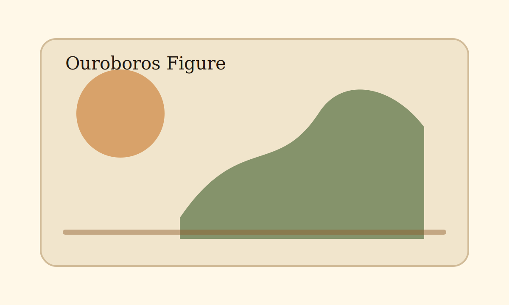

---
tags:
  - theme/publish
  - theme/print
  - theme/m6
cssclasses:
  - research-reading
  - table-wide
  - table-clean
  - figure-note
aliases:
  - Ouroboros Publish Print Showcase
---

# Publish / Print / PDF Showcase

This note tests **M6-6 Publish / Export / Print 支持**.

Use it for three passes:

1. Reading View inside Obsidian.
2. Print / PDF export preview.
3. Obsidian Publish or a Publish-like preview surface, if available.

> [!principle]
> Exported notes should look like quiet documents. They should not carry app chrome, hover-only affordances, or dark-mode-only contrast assumptions.

## Links and references

Internal link: [[core-showcase]]
External link: [Obsidian](https://obsidian.md)
Source note: footnotes should stay readable in print and PDF.[^source]

## Evidence table

| Area | Print/PDF expectation | Publish expectation |
| --- | --- | --- |
| Page background | Warm readable paper, even from dark mode | Same surface tokens as theme |
| Links | Underlined; external URL visible in print | Normal theme link behavior |
| Tables | Header repeats where browser supports it; rows avoid awkward breaks | Warm header and border tokens |
| Code | Wraps instead of clipping | Same code token surface |
| Callouts | Avoid page breaks where possible | Same callout semantics |
| Footnotes | Smaller, separated, readable | Muted reference section |

## Code block

```css
@media print {
  pre {
    white-space: pre-wrap;
    break-inside: avoid;
  }
}
```

## Blockquote and callout

> Export mode is not a screenshot mode. It should preserve hierarchy, evidence, links, and page rhythm.

> [!insight]
> A good PDF pass makes research notes printable without a separate CSS snippet.

## Figure



## Footnotes

[^source]: This footnote should print as a small, separated reference block. It should avoid splitting awkwardly across pages when the browser can honor `break-inside`.

---

## Manual pass

- [ ] Print preview hides app chrome, sidebars, title bars, status bar, and view headers.
- [ ] Dark mode exports as readable light paper, not dark UI.
- [ ] External links show their URL in print/PDF.
- [ ] Internal links do not append noisy URLs.
- [ ] Tables, callouts, code blocks, blockquotes, figures, and footnotes avoid awkward page breaks where possible.
- [ ] Publish-like surface keeps warm sidebars, search, navigation, and markdown body tokens.
